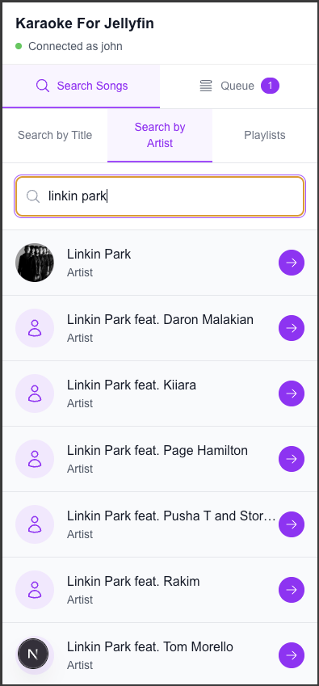
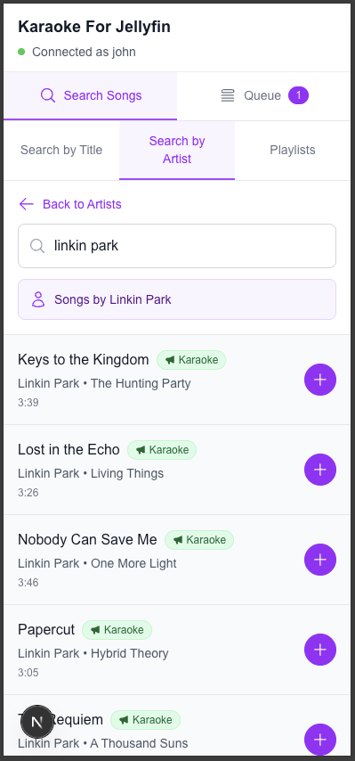
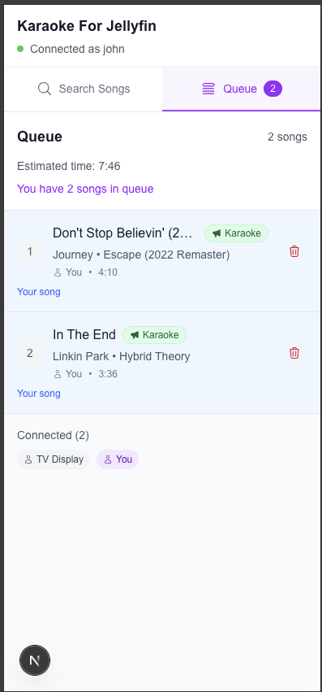
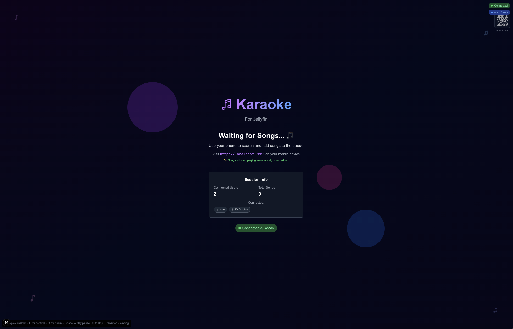
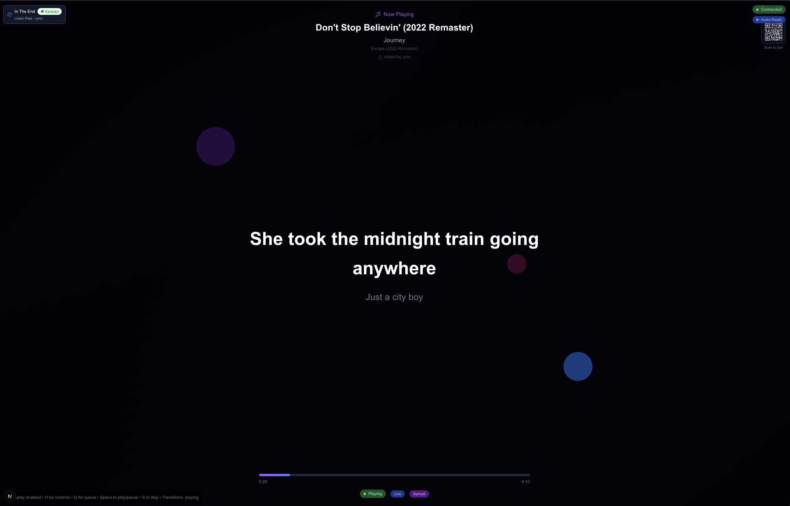
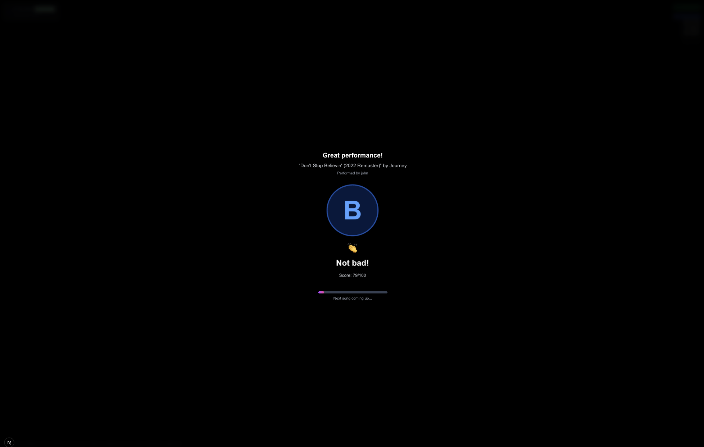
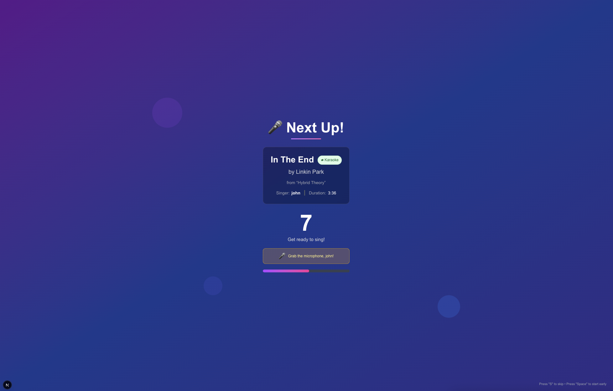

# Karaoke For Jellyfin

[](https://github.com/your-username/karaoke-for-jellyfin/actions/workflows/docker-publish.yml)
[](https://hub.docker.com/r/mrorbitman/karaoke-for-jellyfin)

A web-based karaoke system that integrates with Jellyfin media server to provide karaoke functionality.

The system has three main interfaces:

1. **Mobile Interface** (`<hostname>/`): Search and queue songs from your phone
2. **TV Display** (`<hostname>/tv`): Full-screen karaoke experience for the big screen
3. **Admin Interface** (`<hostname>/admin`): Host controls for managing playback and the karaoke session

### Mobile Interface

Use your phone to search and queue songs while others sing along on the TV.

| Search & Browse                                                             | Add Songs                                                            | Manage Queue                                                         |
| --------------------------------------------------------------------------- | -------------------------------------------------------------------- | -------------------------------------------------------------------- |
|  |             |          |
| Search by artist, playlist, or song title with real-time results            | Add songs to the queue with server confirmation and loading feedback | View and manage the current queue with drag-to-reorder functionality |

### TV Display

Full-screen karaoke experience with lyrics, performance feedback, and queue management.

| Auto-Play & Controls                                            | Sing-Along Lyrics                                           | Performance Rating                                                               | Next Song Countdown                                           |
| --------------------------------------------------------------- | ----------------------------------------------------------- | -------------------------------------------------------------------------------- | ------------------------------------------------------------- |
|  |  |                   |        |
| Automatic playback when songs are added with host controls      | Full-screen lyrics display with real-time synchronization   | Performance ratings and feedback after each song. (These are just random. Shhh!) | Smooth transitions with next song preview and countdown timer |

### Admin Interface

Mobile-optimized host controls for managing the karaoke session.

#### Playback Controls

- **Play/Pause**: Control song playback
- **Skip**: Move to the next song in queue
- **Seek**: Jump to any position in the current song
- **Volume Control**: Adjust system volume and mute/unmute
- **Lyrics Timing**: Fine-tune lyrics synchronization with ±10 second adjustment

#### Queue Management

- **View Queue**: See all pending songs with position, title, artist, and duration
- **Queue Status**: Real-time count of songs in queue
- **Song Details**: View who added each song to the queue

#### Emergency Controls

- **Emergency Stop**: Immediately stop all playback
- **Restart Song**: Jump back to the beginning of the current song
- **Mute Audio**: Quickly silence the system
- **System Status**: Monitor connection status, active users, and queue length

#### Features

- **Real-time Updates**: All controls sync instantly with the TV display
- **User Management**: Admin identification with persistent login
- **Connection Monitoring**: Visual indicators for system connectivity
- **Mobile Optimized**: Touch-friendly interface designed for phones and tablets

---

## Features

- **Mobile Interface**: Search and queue songs from your phone
- **TV Display**: Full-screen lyrics display and playback control
- **Admin Interface**: Comprehensive host controls for session management
- **Jellyfin Integration**: Leverages your existing Jellyfin media library
- **Real-time Sync**: WebSocket-based real-time updates between devices
- **Progressive Web App**: Install on mobile/desktop for native app experience
- **Offline Support**: Core functionality works without internet connection

## Getting Started

### Docker Compose (Recommended)

The easiest way to run Karaoke For Jellyfin is using Docker:

```bash
version: "3.8"
services:
  karaoke-app:
    image: mrorbitman/karaoke-for-jellyfin:latest
    ports:
      - 3967:3000
    environment:
      # Jellyfin Configuration
      - JELLYFIN_SERVER_URL=${JELLYFIN_SERVER_URL:-http://localhost:8096}
      - JELLYFIN_API_KEY=${JELLYFIN_API_KEY}
      - JELLYFIN_USERNAME=${JELLYFIN_USERNAME}

      # OPTIONAL Playlist Filtering
      - PLAYLIST_FILTER_REGEX=${PLAYLIST_FILTER_REGEX}

      # OPTIONAL TV Display Timing Configuration (in milliseconds)
      - RATING_ANIMATION_DURATION=${RATING_ANIMATION_DURATION:-15000}
      - NEXT_SONG_DURATION=${NEXT_SONG_DURATION:-15000}
      - CONTROLS_AUTO_HIDE_DELAY=${CONTROLS_AUTO_HIDE_DELAY:-10000}
      - AUTOPLAY_DELAY=${AUTOPLAY_DELAY:-500}
      - QUEUE_AUTOPLAY_DELAY=${QUEUE_AUTOPLAY_DELAY:-1000}
      - TIME_UPDATE_INTERVAL=${TIME_UPDATE_INTERVAL:-2000}

      # System Configuration
      - NODE_ENV=production
      - PORT=3000
      - HOSTNAME=0.0.0.0
    restart: always
networks: {}

```

### Local Development

### Prerequisites

- Node.js 18+
- A running Jellyfin server
- Audio files in your Jellyfin library

### Installation

1. Clone the repository
2. Install dependencies:

   ```bash
   npm install
   ```

3. Copy the environment configuration:

   ```bash
   cp .env.local.example .env.local
   ```

4. Update `.env.local` with your Jellyfin server details

5. Run the development server:

   ```bash
   npm run dev
   ```

6. Open the interfaces:
   - **Mobile**: [http://localhost:3000](http://localhost:3000)
   - **TV Display**: [http://localhost:3000/tv](http://localhost:3000/tv)
   - **Admin**: [http://localhost:3000/admin](http://localhost:3000/admin)

## Usage

### Setting Up a Karaoke Session

1. **Start the TV Display**: Open `<hostname>/tv` on your main display
2. **Admin Setup**: Open `<hostname>/admin` on your phone/tablet for host controls
3. **Share with Guests**: Have guests scan the QR code or visit `<hostname>/` to add songs

### Host Controls

The admin interface provides three main control panels:

- **Playback**: Control current song playback, volume, and lyrics timing
- **Queue**: Monitor upcoming songs and queue status
- **Emergency**: Quick access to emergency controls and system status

### Tips for Hosts

- Use the **lyrics offset** control if lyrics appear too early or late
- The **emergency stop** button immediately halts playback for technical issues
- Monitor the **system status** panel to track active users and connection health
- **Volume controls** affect the entire system, not just individual songs

## Project Structure

```
src/
├── app/
│   ├── api/          # API routes
│   ├── admin/        # Admin interface
│   ├── tv/           # TV display interface
│   └── page.tsx      # Mobile interface
├── components/
│   ├── mobile/       # Mobile-specific components
│   └── tv/           # TV-specific components
├── lib/              # Utility libraries
├── services/         # Business logic services
└── types/            # TypeScript type definitions
```

## Development Status

This project is currently in development. See the implementation tasks in `.kiro/specs/self-hosted-karaoke/tasks.md` for current progress.
