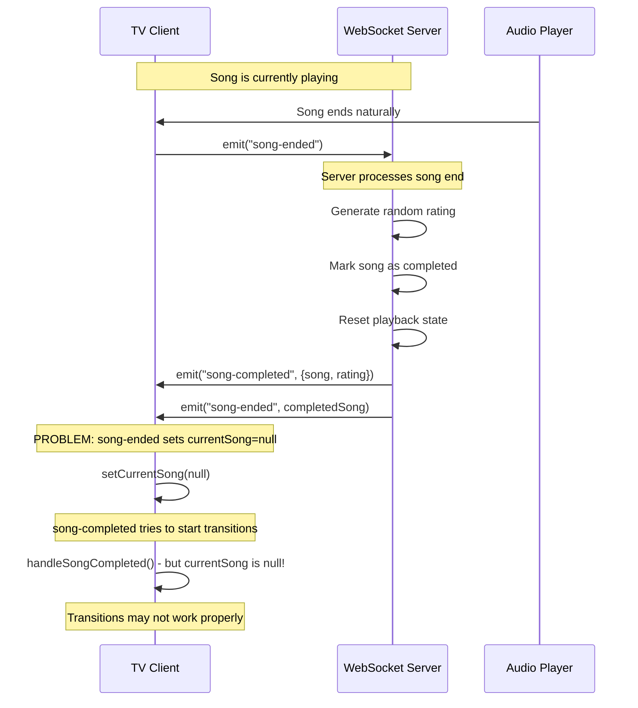
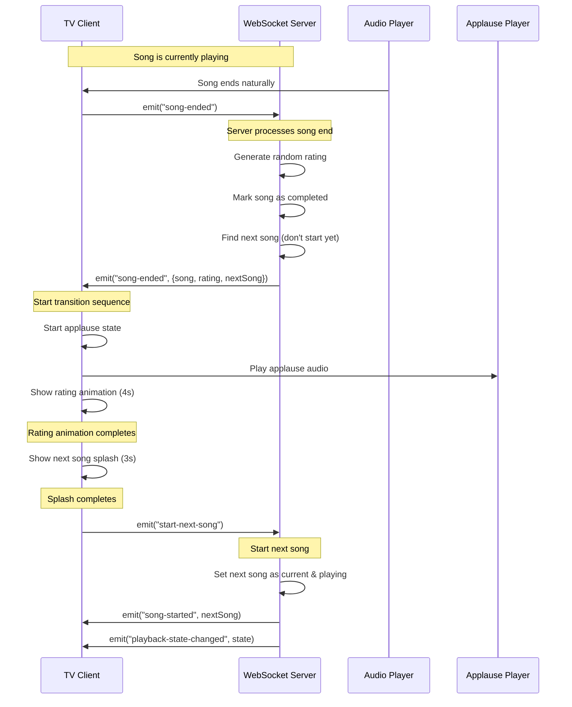
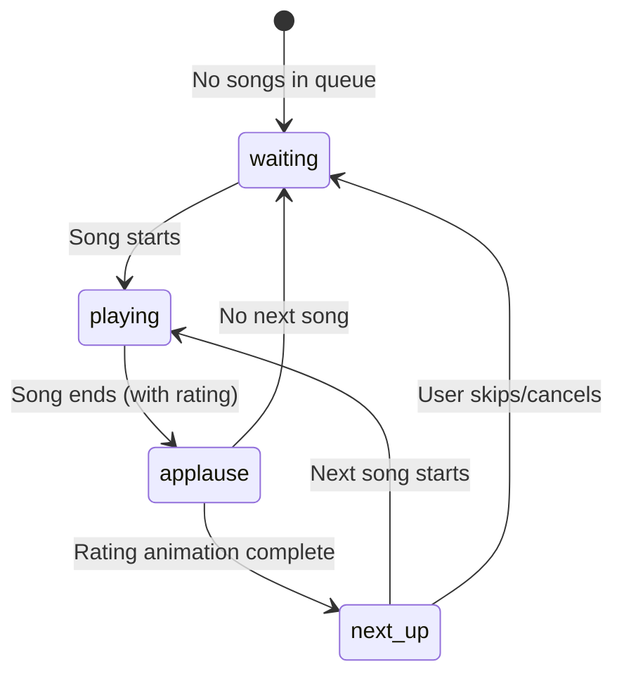

# WebSocket Event Flow for Karaoke Transitions

This document explains the WebSocket event flow for handling song transitions, applause, and ratings in the karaoke app.

## Current Flow (With Issues)



## Issues with Current Flow

1. **Race Condition**: `song-ended` and `song-completed` events are emitted simultaneously
2. **State Conflict**: `song-ended` sets `currentSong = null` before transitions can use the song data
3. **Redundant Events**: We have two events doing similar things
4. **Applause Not Triggering**: Transitions don't start because song data is cleared

## Proposed Simplified Flow



## Event Definitions

### Client → Server Events

| Event | Payload | Description |
|-------|---------|-------------|
| `song-ended` | `null` | Sent when audio player detects song end |
| `start-next-song` | `null` | Request to start next song after transitions |
| `playback-control` | `PlaybackCommand` | Play/pause/seek controls |
| `join-session` | `{sessionId, userName}` | Join karaoke session |

### Server → Client Events

| Event | Payload | Description |
|-------|---------|-------------|
| `song-ended` | `{song, rating, nextSong?}` | Song completed with rating data |
| `song-started` | `QueueItem` | New song has started playing |
| `queue-updated` | `QueueItem[]` | Queue has changed |
| `playback-state-changed` | `PlaybackState` | Playback state updated |

## State Management

### TV Display States



### Client State Flow

1. **Playing State**: 
   - Current song is active
   - Lyrics display visible
   - Audio playing

2. **Applause State** (4 seconds):
   - Applause audio plays
   - Rating animation shows
   - Song data still available for display

3. **Next-Up State** (3 seconds):
   - Next song information displayed
   - Countdown timer
   - Microphone reminder

4. **Transition State**:
   - Brief state while starting next song
   - Server processes start-next-song request

## Implementation Changes Needed

### 1. Simplify Server Events

```javascript
// Instead of emitting both events:
io.to(sessionId).emit("song-completed", { song: completedSong, rating: rating });
io.to(sessionId).emit("song-ended", completedSong);

// Emit single event with all data:
io.to(sessionId).emit("song-ended", { 
  song: completedSong, 
  rating: rating,
  nextSong: nextSong || null
});
```

### 2. Update Client Handler

```javascript
socket.on("song-ended", (data) => {
  if (data.rating) {
    // This is a completion with rating - start transitions
    handleSongCompleted(data);
  } else {
    // This is a simple song end (skip, etc.) - just clear current song
    setCurrentSong(null);
  }
});
```

### 3. Remove Redundant Events

- Remove `song-completed` event entirely
- Use enhanced `song-ended` event for all song completions
- Keep existing `song-started` for new songs

## Benefits of Simplified Flow

1. **No Race Conditions**: Single event with all needed data
2. **Clearer State Management**: One source of truth for song completion
3. **Reliable Applause**: Transitions start immediately with song data intact
4. **Easier Debugging**: Fewer events to track
5. **Better Performance**: Less network traffic

## Testing the Flow

### Manual Test Steps

1. **Start a song** - Verify `song-started` event and playing state
2. **Let song complete naturally** - Check for applause and rating animation
3. **Verify next song splash** - Confirm countdown and song info display
4. **Check auto-start** - Next song should begin automatically
5. **Test skip functionality** - Space/S keys should skip transitions

### Debug Console Messages

```javascript
// Expected console output:
"Song ended naturally, notifying server"
"Generated rating for 'Song Title': A+ (95/100)"
"Song ended with rating data: {song: {...}, rating: {...}}"
"Song completed via socket, starting transition sequence"
"Applause playing successfully via socket trigger"
"Rating animation complete"
"Next song splash complete, starting next song"
"Starting next song: Next Song Title"
```

## Error Handling

### Common Issues

1. **No Applause Audio**: Check browser console for autoplay errors
2. **Transitions Skip**: Verify socket events are being received
3. **Rating Not Showing**: Check that rating data is in song-ended event
4. **Next Song Doesn't Start**: Verify start-next-song event is sent

### Debugging Commands

```javascript
// In browser console on TV page:
// Check current transition state
console.log(window.transitionState);

// Check WebSocket connection
console.log(window.socket?.connected);

// Manually trigger applause
window.dispatchEvent(new CustomEvent('test-applause'));
```
